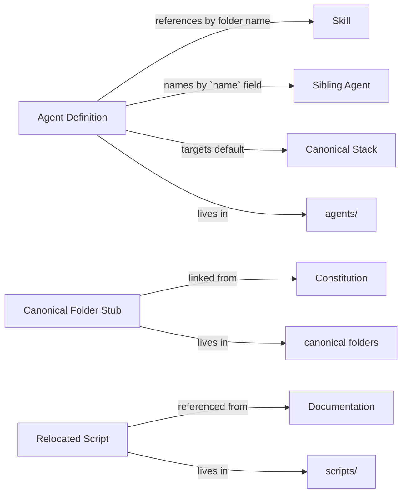

# Phase 1 — Data Model

**Feature**: Repository Restructure and Role-Based Agent Creation
**Date**: 2026-04-17

The "data" this feature manipulates is files on disk. There is no runtime
database or persisted object model. The entities below describe the
*schema of artifacts* so contracts can be validated against them.

---

## Entity: Agent Definition

A single Markdown file at `agents/<agent-name>.md` carrying YAML frontmatter
plus a structured body. This is the Claude Code native agent schema.

### Location

```
agents/<agent-name>.md
```

### Identity

| Attribute | Rule |
|-----------|------|
| `agent-name` | kebab-case, unique across `agents/`, MUST match the filename stem and the frontmatter `name` field |

### Frontmatter (YAML)

| Field | Type | Required | Rule |
|-------|------|----------|------|
| `name` | string | YES | kebab-case; equal to filename stem |
| `description` | string | YES | Single sentence stating trigger conditions; orchestrators use this for routing |
| `tools` | string (comma-separated) or list | YES | Explicit allowlist; no implicit "all tools" |
| `model` | string | NO | Optional override (`opus`, `sonnet`, `haiku`); omit to inherit |

### Body sections (required order)

1. **`# <Agent Display Name>`** — H1 with the human-readable role.
2. **Role & Scope** — one paragraph defining what the agent does and for whom.
3. **Composed Skills** — bulleted list of skill folder names under `skills/`, each bullet noting *when* that skill is invoked.
4. **Default Behavior** — numbered rules the agent follows on every invocation (e.g., "read the solution structure before generating code").
5. **Boundaries / Out of Scope** — bulleted list of disallowed scopes, each naming the sibling agent that owns the scope (per Clarification Q3 "name-and-stop").
6. **Output Language** — one line; for developer/QA agents this is "English". For `analyst`, this is "PT-BR by default; EN when user explicitly requests or writes in EN" (per Q4).

### Validation rules

- `name` MUST match `^[a-z][a-z0-9-]*$` and equal the filename stem.
- `description` MUST NOT exceed 200 characters to stay discoverable in routing UIs.
- `tools` MUST be an explicit list; the token `*` or the field absent is forbidden.
- Body MUST include all six sections in order.
- `Composed Skills` bullets MUST reference existing folders under `skills/`.
- `Boundaries / Out of Scope` bullets MUST reference existing agents under `agents/` by their `name` field.

### Constraints enforced at author time (manual for this feature)

- Principle III: file content English-only.
- Principle V: kebab-case filename.
- FR-011: no copy-paste of skill content into the agent body.

---

## Entity: Canonical Folder Stub

A `README.md` at the root of each newly created canonical folder (`rules/`,
`agents/`, `commands/`, `docs/`, `scripts/`).

### Location

```
<folder>/README.md
```

### Content schema

1. `# <Folder Name>` — H1.
2. One sentence quoting the constitution's purpose for this folder.
3. A "Language policy" line (EN-only vs bilingual).
4. A "Authoring standards" line pointing to Principle V.
5. A link to `.specify/memory/constitution.md`.

### Validation rules

- File exists at the expected path.
- File is ≤ 20 lines (stub, not documentation).
- Content is English (language policy for `rules/`, `agents/`, `commands/`,
  `scripts/`; `docs/` is bilingual but this stub is EN for consistency).

---

## Entity: Relocated Script

A PowerShell utility moved from the repo root to `scripts/` with history
preserved via `git mv`.

### Before → After

| Before (root) | After |
|---------------|-------|
| `collect-skills.ps1` | `scripts/collect-skills.ps1` |
| `copy-dependency.ps1` | `scripts/copy-dependency.ps1` |
| `push-skill.ps1` | `scripts/push-skill.ps1` |
| `replace-skill.ps1` | `scripts/replace-skill.ps1` |

### Validation rules

- Each file exists at its new path.
- Neither file exists at the old root path.
- `git log --follow` on the new path shows pre-move commits (history preserved).
- Every mention of the old path in `README.md`, `CLAUDE.md`, and
  `.github/workflows/**/*.yml` is rewritten to the new path. A `grep` for
  each old filename against those files returns zero hits after the move.

---

## Entity: Documentation Reference Update

An edit to `README.md` or `CLAUDE.md` that refreshes a path reference.

### Validation rules

- No string `(collect-skills\|copy-dependency\|push-skill\|replace-skill)\.ps1`
  appears outside a `scripts/` prefix in any of the referenced files.
- Prose narrative mentioning "the script" resolves unambiguously to the
  new path via surrounding context or an explicit link.

---

## Relationships



Skill references from an Agent Definition are the only outbound pointer; a
skill does NOT know which agent composes it. This keeps skills independent
and lets new agents adopt skills without modifying `skills/`.
